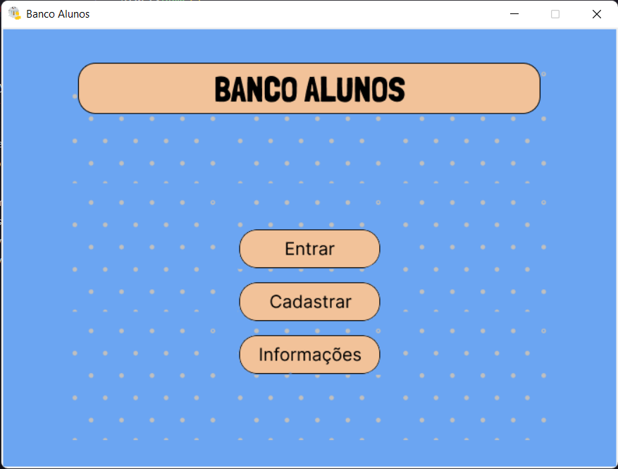

<h1 align="center">Banco Alunos</h1>

Banco para alunos

Aplicação não real, feita para estudos e para entretenimento 🚀

  <a href="#-tecnologias">Tecnologias</a>&nbsp;&nbsp;&nbsp;|&nbsp;&nbsp;&nbsp;
  <a href="#-projeto">Projeto</a>&nbsp;&nbsp;&nbsp;|&nbsp;&nbsp;&nbsp;
  <a href="#-como-rodar-na-sua-maquina">Executar</a>&nbsp;&nbsp;&nbsp;|&nbsp;&nbsp;&nbsp;
  <a href="#-layout">Layout</a>&nbsp;&nbsp;&nbsp;|&nbsp;&nbsp;&nbsp;
  <a href="#licença">Licença</a>

    
    
    

    
    

## 🚀 Tecnologias

Esse projeto foi desenvolvido com as seguintes tecnologias:

- Python
- Git e Github
- Figma

## 💻 Projeto

O Banco Alunos é uma aplicação simple que simula um banco, só que só para alunos, mas não é um aplicação identica a real.

## 🧑‍💻 Como rodar na sua maquina

Para rodar a aplicação é bom ter um editor para trabalhar com o código como VSCode

Para rodar o código é preciso executar o arquivo <i>Banco_Alunos.py</i> sendo esse o "pai" de todos, o resposável por chama-los

## 🔖 Layout

Você pode visualizar o layout do projeto através [DESSE LINK](https://www.figma.com/file/SOJ4NJm6RFMuUAbcGk0Laq/Banco-Alunos?type=design&mode=design&t=V3VTEmgIPRE3tC8p-1). É necessário ter conta no [Figma](https://figma.com) para acessá-lo.

## 📝 Licença

Esse projeto está sob a licença MIT.

### Autor
---
Feito com ❤️ por <b>Francisco Kaik</b> 🚀